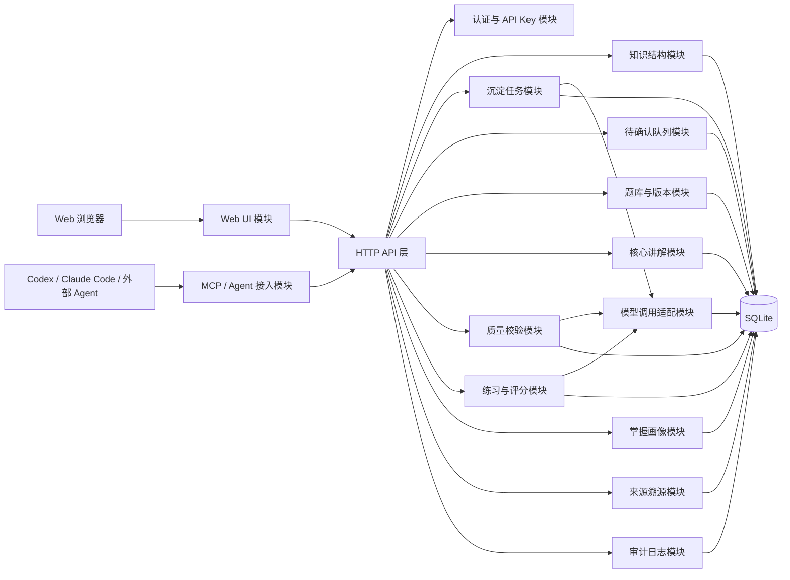
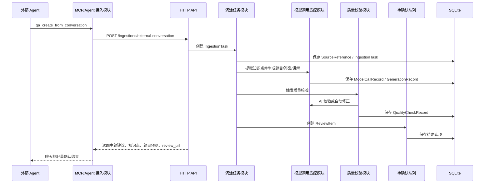
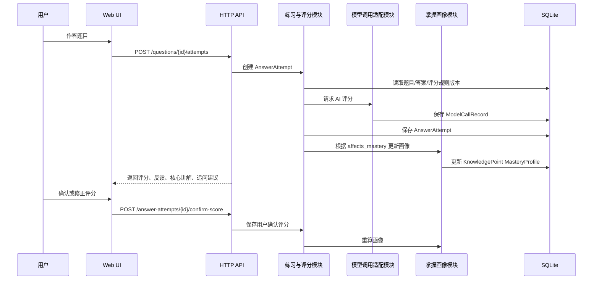

# 个人知识问答系统架构设计

日期：2026-06-07

关联文档：

```text
docs/knowledge-qa-business-model.md
docs/knowledge-qa-domain-model.md
docs/knowledge-qa-er-diagram.md
docs/knowledge-qa-api-draft.md
docs/knowledge-qa-mcp-tools.md
docs/TODO.md
```

## 阶段：架构设计

阶段结论：

```text
MVP 采用模块化单体 + 全栈应用架构。
系统以本地 Web + API 服务为核心，SQLite 作为第一版存储。
MCP/Agent 调用能力是系统验收标准的一部分，但第一版先以 API + MCP schema + 可验证 Agent 调用闭环为目标。
```

已确认事项：

```text
MVP 架构形态：模块化单体。
前后端形态：全栈应用，同一项目包含 Web 页面和后端 API。
通信方式：HTTP API 为主，MCP Tool 作为 Agent 接入层，后台任务作为长流程扩展边界。
后台任务队列：第一版不引入独立队列，先同步执行或应用内轻量任务。
AI 生成和质量校验：业务按任务状态建模，技术上第一版同步执行为主。
存储方案：SQLite。
缓存：不引入 Redis 等独立缓存，仅使用应用内轻量缓存。
向量库：MVP 不引入，后续文档导入和语义检索再扩展。
认证：Web 本地单用户，API/Agent 调用使用 API Key。
部署：本地服务部署，不使用 Docker，后续迁移到 Linux 系统服务。
默认模型：chatgpt-5.5。
默认 AI Agent：Codex。
```

待确认事项：

```text
具体技术栈和框架。
本地服务端口。
API Key 生成、保存和轮换方式。
确认链接的具体 URL 规则。
```

风险点：

```text
同步执行 AI 长流程可能导致页面等待时间较长，需要通过任务状态和处理中提示缓解。
SQLite 适合 MVP，但模型调用记录、审计事件和版本数据增长后，需要评估 PostgreSQL。
MCP/Agent 能力如果只停留在 schema，验收时必须至少提供可模拟的 Agent 调用闭环。
```

下一步动作：

```text
进入核心流程设计，生成 docs/knowledge-qa-core-flows.md。
```

## 1. 架构总览

```text
用户浏览器
  -> 本地 Web 页面
  -> 后端 HTTP API
  -> 领域服务模块
  -> SQLite

Codex / Claude Code / 其他 Agent
  -> MCP Tool 或 Agent 调用适配层
  -> 后端 HTTP API
  -> 沉淀任务 / 待确认 / 题目生成
```

核心原则：

```text
Web 页面和 MCP/Agent 都调用同一套 API。
MCP/Agent 接入层不承载核心业务逻辑。
业务逻辑集中在模块化单体内的领域服务。
AI 调用通过模型适配模块统一出入口。
所有生成、质检、评分和修正都记录溯源和审计。
```

## 2. 模块图



## 3. 模块职责

| 模块 | 职责 |
|---|---|
| Web UI 模块 | 待确认、编辑、练习、画像查看、错误集复盘 |
| HTTP API 层 | 对 Web、MCP/Agent 暴露统一业务接口 |
| MCP / Agent 接入模块 | 将 Agent 调用转换为 HTTP API 调用，返回轻量预览和链接 |
| 认证与 API Key 模块 | 本地用户、API Key 校验、后续扩展登录 |
| 知识结构模块 | 领域、主题、知识点、知识类型管理 |
| 沉淀任务模块 | 主题学习、即时掌握、外部会话沉淀任务 |
| 待确认队列模块 | 统一管理待确认、确认、拒绝、编辑 |
| 题库与版本模块 | 题目、题目版本、答案版本、评分规则版本 |
| 核心讲解模块 | 知识点通用讲解、题目补充讲解及版本 |
| 质量校验模块 | 规则校验、AI 校验、自动修正、人工处理 |
| 练习与评分模块 | 练习会话、答题记录、AI 评分、用户修正 |
| 掌握画像模块 | 知识点/主题/领域画像计算和查询 |
| 来源溯源模块 | SourceReference、GenerationRecord、ModelCallRecord |
| 审计日志模块 | 记录生成、确认、编辑、评分、修正、归档等事件 |
| 模型调用适配模块 | 默认 chatgpt-5.5，记录 token、耗时、成本和模型元数据 |

## 4. 核心数据流图

### 4.1 外部会话沉淀数据流



### 4.2 答题评分数据流



## 5. 长流程处理策略

长流程包括：

```text
主题学习生成
外部会话沉淀
题目质量校验和自动修正
掌握画像重算
模型质量统计
```

MVP 策略：

```text
业务上使用 IngestionTask、QualityCheckRecord、ModelCallRecord 等对象承载状态。
技术上第一版同步执行为主。
页面/API 返回任务状态和结果。
如果处理耗时较长，页面显示处理中状态，允许用户稍后刷新。
后续可把同一状态机迁移到后台任务队列。
```

## 6. 存储架构

MVP：

```text
SQLite
本地文件数据库
关系型表结构
JSON 字段保存半结构化内容
```

后续迁移：

```text
Linux 系统服务
数据量增长后评估 PostgreSQL
文档导入和语义检索阶段评估向量库
```

不引入：

```text
Redis
独立消息队列
向量库
对象存储
```

## 7. Agent/MCP 调用能力验收口径

系统验收不能只验证普通 Web/API，必须验证 AI Agent MCP/Agent 调用能力。

MVP 验收至少包括：

```text
通过 Agent/MCP 调用提交外部会话沉淀请求。
系统创建 IngestionTask。
系统返回主题建议、知识点列表、题目预览。
系统返回 review_url。
用户可通过 Web 页面查看待确认内容。
重复提交时幂等处理生效。
```

第一版允许：

```text
使用模拟 Agent 调用。
使用 MCP Tool schema + 本地调用脚本验证。
后续再实现完整 MCP Server。
```

## 8. 被放弃的备选方案

### 8.1 微服务

放弃原因：

```text
MVP 是个人本地系统，微服务会带来部署、通信、监控和数据一致性复杂度。
当前更需要快速验证业务闭环。
```

### 8.2 前后端完全分离

放弃原因：

```text
第一版本地服务优先，全栈应用更轻。
后端 API 仍然保留清晰边界，未来可以拆分前端。
```

### 8.3 纯 API 原型

放弃原因：

```text
待确认、编辑、练习和画像查看需要 Web 交互。
纯 API 无法很好验证用户学习闭环。
```

### 8.4 第一版引入 Docker

放弃原因：

```text
用户已确认先本地服务部署。
Docker 后续迁移 Linux 时再考虑。
```

### 8.5 第一版引入独立后台队列

放弃原因：

```text
会增加部署和运维复杂度。
领域模型已通过任务状态预留异步迁移空间。
```

### 8.6 第一版引入向量库

放弃原因：

```text
当前主入口是对话沉淀和主动生成问答，不是大规模文档 RAG。
后续文档导入、Embedding、语义检索阶段再引入。
```

## 9. 架构检查结论

```text
当前架构没有引入微服务、独立队列、Redis、向量库等额外基础设施，适合 MVP。
模块边界已覆盖核心业务路径。
API 和 MCP/Agent 入口共享同一业务底座，避免重复实现。
版本、审计和模型调用记录从第一版纳入，满足后续追踪和质量分析需要。
```

