# 个人知识问答系统核心流程设计

日期：2026-06-07

关联文档：

```text
docs/knowledge-qa-business-model.md
docs/knowledge-qa-domain-model.md
docs/knowledge-qa-architecture.md
docs/knowledge-qa-api-draft.md
docs/knowledge-qa-mcp-tools.md
docs/TODO.md
```

## 阶段：核心流程设计

阶段结论：

```text
核心流程覆盖主题学习、即时掌握、外部会话沉淀、题目生成质检、正式入库、答题评分、用户修正、掌握画像、错误集、临时题和来源冲突处理。
所有流程均保留审计点，长流程通过任务状态承载，MVP 技术上同步执行，架构上预留异步队列迁移。
```

已确认事项：

```text
待确认内容未正式入库前，不参与正式练习和长期掌握画像。
临时题答完后，用户确认才可入库；是否补计入长期掌握度由用户选择。
外部 Agent 调用能力是验收标准的一部分。
AI 生成和质量校验第一版同步执行，但必须有任务状态。
```

待确认事项：

```text
质量校验超过自动修正次数后，用户编辑后是否立即重新触发校验。
来源冲突是否统一进入 ReviewItem 待确认队列。
练习会话是否允许用户中途取消后继续恢复。
```

风险点：

```text
AI 生成和质检是长流程，可能出现部分失败，需要保留失败状态和人工处理入口。
如果缺少审计点，后续无法分析题目质量、模型质量和用户修正原因。
```

下一步动作：

```text
进入题目生成与质量校验细化，生成 docs/knowledge-qa-generation-quality.md。
```

## 1. 主题学习流程

适用场景：

```text
用户想系统学习一个主题，例如 GitHub Actions、RAG 知识问答系统。
```

正常路径：

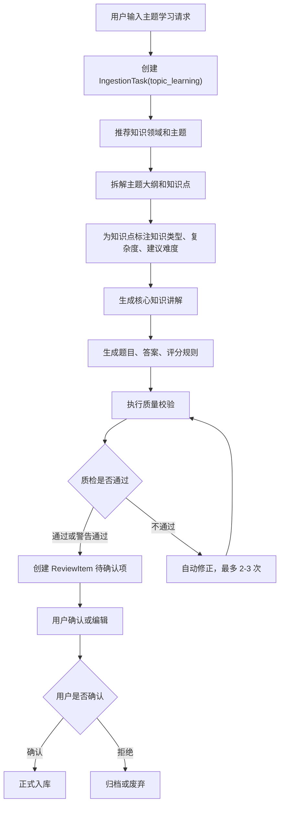

异常路径：

```text
领域推荐失败：允许用户手动选择领域。
知识点拆解失败：IngestionTask 标记 failed，并保留失败原因。
部分题目质检失败：通过题进入待确认，失败题进入待人工处理。
用户长时间未确认：ReviewItem 保持 pending，不影响正式题库。
```

审计点：

```text
主题学习请求提交
领域/主题推荐完成
知识点拆解完成
题目和讲解生成完成
质量校验完成
用户编辑
用户确认入库
用户拒绝
任务失败
```

## 2. 即时掌握流程

适用场景：

```text
用户临时遇到一个知识点，只想先理解并快速检测掌握情况。
```

正常路径：

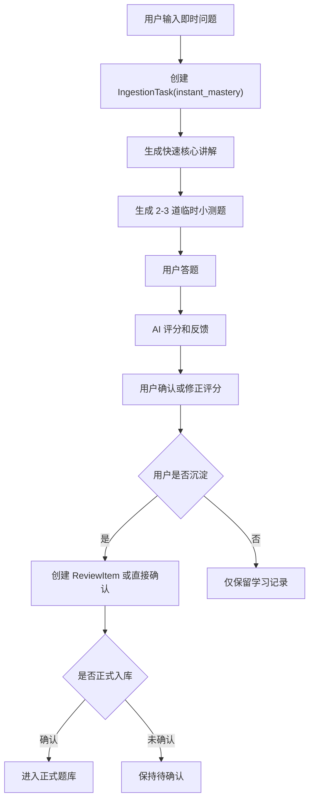

异常路径：

```text
用户只想解释不想答题：只生成讲解，不创建 PracticeSession。
临时题质量不足：可重新生成，不进入正式题库。
用户未确认沉淀：AnswerAttempt affects_mastery=false。
```

审计点：

```text
即时掌握请求
讲解生成
临时题生成
用户答题
AI 评分
用户修正评分
用户选择沉淀或不沉淀
```

## 3. 外部会话沉淀流程

适用场景：

```text
用户在 Codex、Claude Code 或其他 AI Agent 中发现某段会话有学习价值。
```

正常路径：

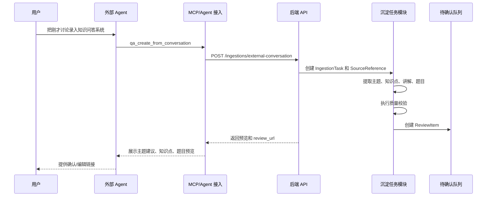

异常路径：

```text
缺少会话内容和摘要：返回 CONTEXT_REQUIRED。
外部 Agent 重复提交：通过 Idempotency-Key 返回同一任务。
会话内容疑似包含密钥：提示用户确认是否沉淀或脱敏后沉淀。
API Key 无效：返回 API_AUTH_FAILED。
```

审计点：

```text
Agent 调用
外部来源记录
幂等命中或冲突
生成完成
返回 Agent 预览
用户后续确认或编辑
```

## 4. 题目生成和质量校验流程

正常路径：

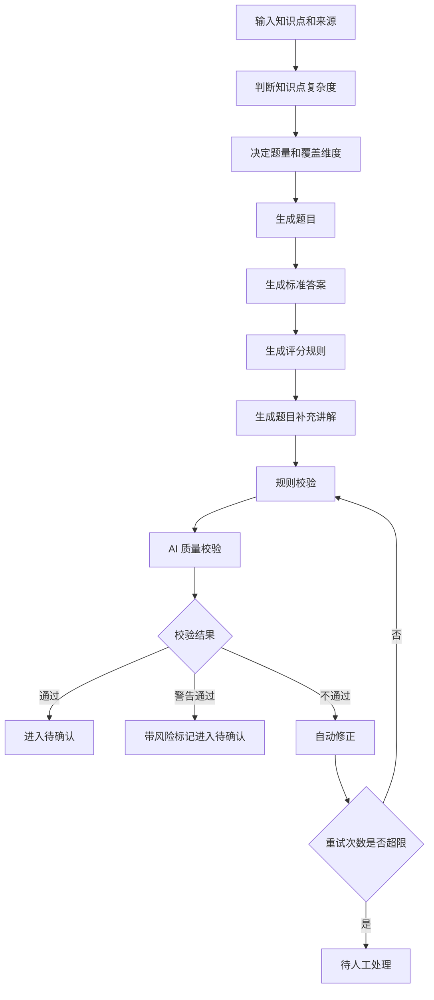

异常路径：

```text
无法判断复杂度：标记为 medium，并要求用户确认。
来源支撑不足：事实/概念/操作类题目不通过。
重复度过高：单题自动修正，不重写整批。
自动修正仍失败：进入待人工处理。
```

审计点：

```text
复杂度判断
题目生成
答案生成
评分规则生成
规则校验
AI 校验
自动修正
人工处理
```

## 5. 待确认到正式入库流程

正常路径：

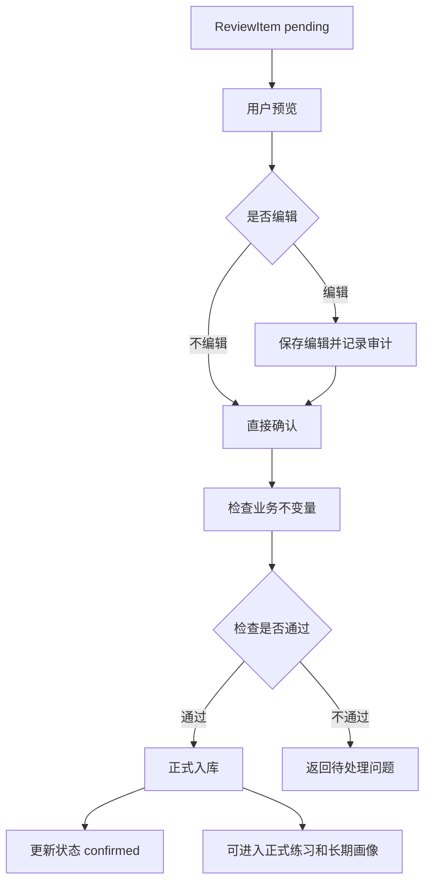

业务不变量：

```text
正式入库的题目必须有 active QuestionVersion。
正式入库的题目必须有 active AnswerVersion。
正式入库的题目必须有 active ScoringRubricVersion。
题目正式入库前必须有 QualityCheckRecord。
```

审计点：

```text
用户预览
用户编辑
用户确认
正式入库
业务规则校验失败
```

## 6. 答题评分流程

正常路径：

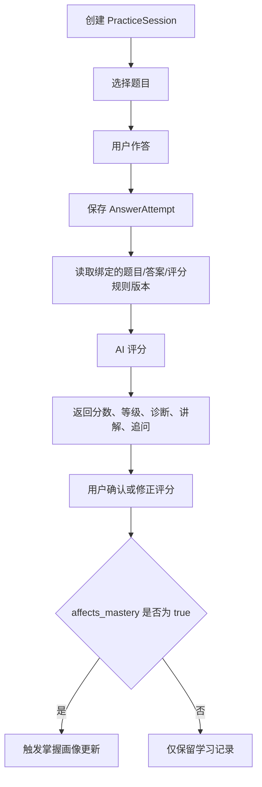

异常路径：

```text
版本 ID 不匹配：返回 BUSINESS_RULE_VIOLATION。
AI 评分失败：保存 AnswerAttempt，评分状态为空，允许稍后重试评分。
用户不确认评分：可保留 AI 原始评分，但不更新用户确认评分。
```

审计点：

```text
练习会话创建
用户答题
AI 评分
用户确认评分
用户修正评分
掌握画像更新
```

## 7. 用户修正评分流程

正常路径：

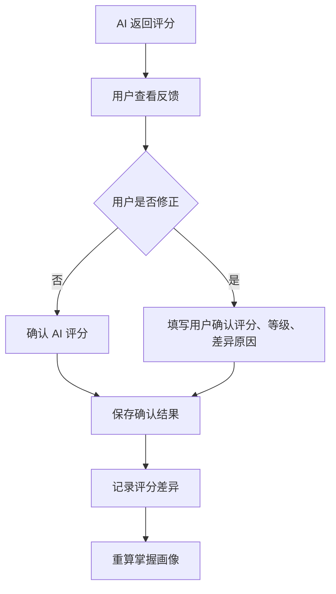

差异原因候选：

```text
AI 误判
用户表达不清
用户确实未掌握
标准答案不完善
评分规则不合理
```

审计点：

```text
AI 原始评分
用户确认评分
差异原因
画像重算
```

## 8. 掌握画像更新流程

正常路径：

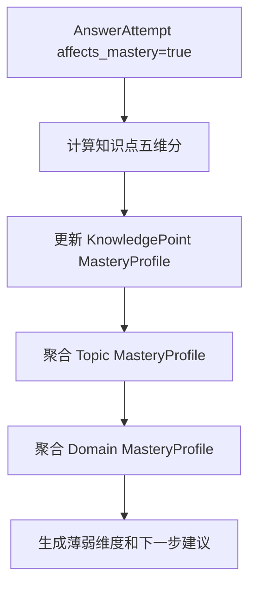

重算触发：

```text
新增正式答题记录
用户确认或修正评分
临时题确认入库并选择补计入
错误集状态变化
题目/答案/评分规则重要版本变化
```

审计点：

```text
画像计算开始
画像计算完成
画像异常
画像来源答题记录
```

## 9. 错误集生成和复盘流程

正常路径：

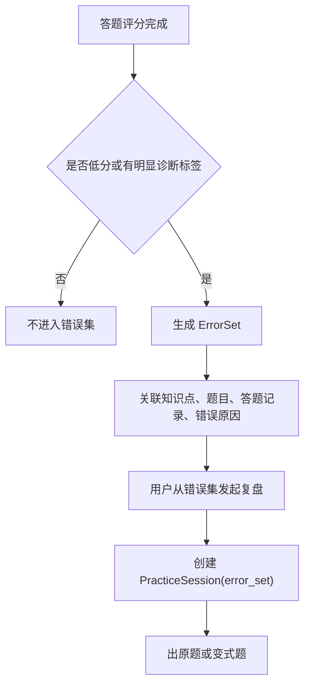

异常路径：

```text
用户认为不是错题：可标记 resolved 或 archived。
同一答题记录已生成错误集：避免重复创建。
```

审计点：

```text
错误集创建
错误原因记录
错误集复盘
错误项解决
```

## 10. 临时题确认入库流程

正常路径：

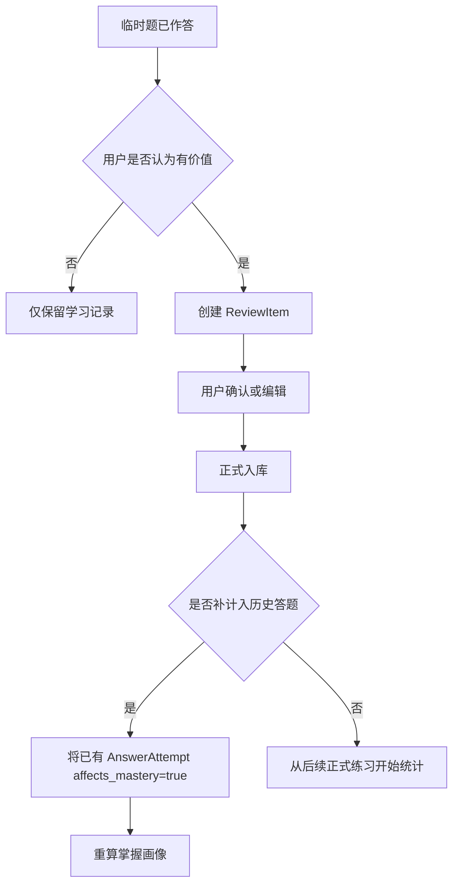

审计点：

```text
临时题作答
用户选择入库
用户选择是否补计入
画像重算
```

## 11. 来源冲突处理流程

正常路径：

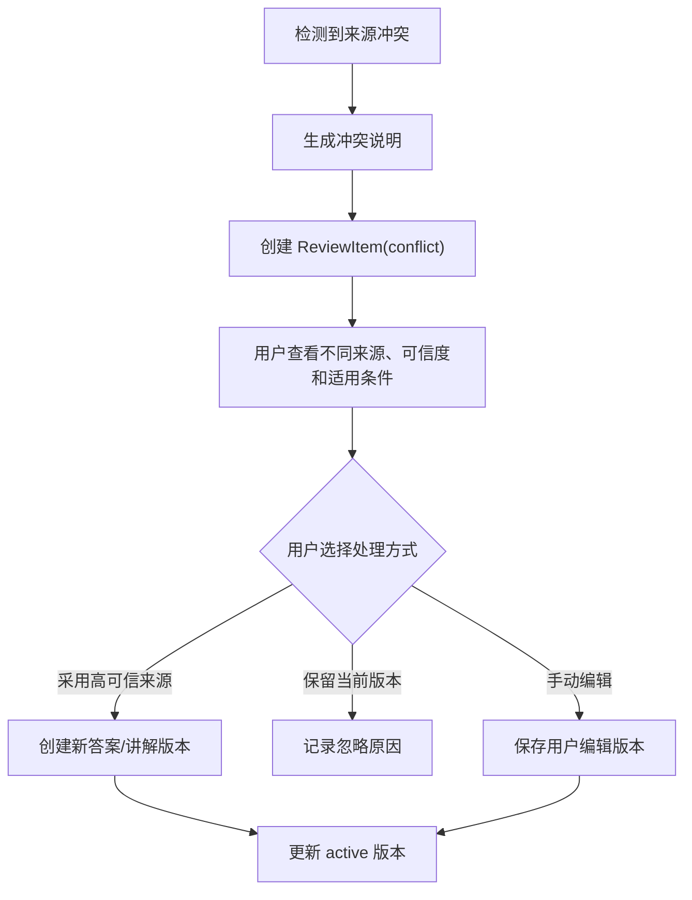

不变量：

```text
来源冲突不得自动覆盖 active 标准答案。
用户确认前，只能生成候选版本和冲突说明。
```

审计点：

```text
冲突检测
冲突说明生成
用户确认处理方式
版本更新
忽略冲突
```

## 12. 超时、取消、重试和人工处理

超时：

```text
模型调用超时：记录 ModelCallRecord failed，任务进入 failed 或待重试状态。
质量校验超时：保留已生成内容，标记 quality_check_failed。
```

取消：

```text
PracticeSession 可取消。
IngestionTask 在 submitted / extracting / generated 阶段可取消。
pending_review 状态下用户可拒绝或归档。
```

重试：

```text
模型调用失败可手动重试。
质量校验自动修正最多 2-3 次。
外部 Agent 创建类请求通过 Idempotency-Key 去重。
```

人工处理：

```text
质量校验多次失败进入待人工处理。
来源冲突进入待确认队列。
题目、答案、评分规则可由用户编辑后重新校验。
```

## 13. 核心流程验收点

```text
主题学习能生成待确认内容。
即时掌握能生成讲解和临时题。
外部 Agent 调用能创建沉淀任务并返回预览和链接。
质检失败能自动修正或进入待人工处理。
确认入库后题目进入正式题库。
答题记录绑定历史版本。
用户修正 AI 评分后能记录差异原因。
掌握画像能在知识点、主题、领域三个层级更新。
错误集能从低分答题生成。
临时题未确认不进入长期画像。
来源冲突不会自动覆盖标准答案。
```

