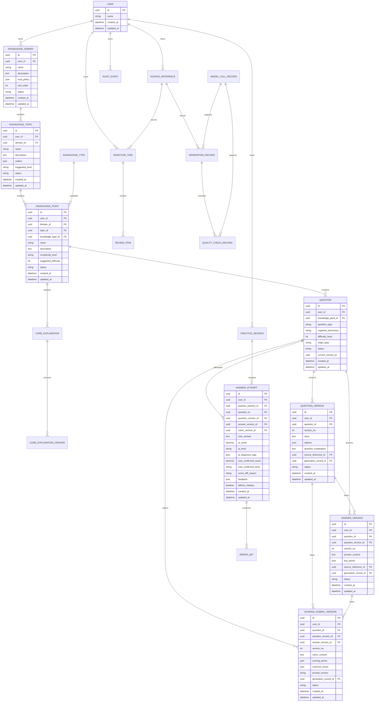

# 个人知识问答系统 ER 图与数据模型草案

日期：2026-06-06

关联文档：

```text
docs/knowledge-qa-business-model.md
docs/knowledge-qa-domain-model.md
docs/TODO.md
```

## 阶段：数据设计和 ER 图

阶段结论：

```text
已将领域模型落到关系型数据模型草案。
MVP 推荐使用关系型数据库承载版本、审计、状态流和多层级掌握画像。
本文为草案，后续进入技术栈选择和迁移实现时需要转换为具体 DDL。
```

已确认事项：

```text
所有核心表保留 id、created_at、updated_at。
核心业务表保留 user_id。
新增 IngestionTask、ReviewItem、PracticeSession、ModelCallRecord。
MasteryProfile 通过 target_type + target_id 支持领域、主题、知识点三个层级。
AnswerAttempt 必须绑定题目、答案、评分规则的历史版本。
```

待确认事项：

```text
是否统一添加 deleted_at 软删除字段。
数据库使用 SQLite 还是 PostgreSQL。
JSON 字段在目标数据库中的具体类型。
MasteryProfile 是实时更新还是异步重算。
```

风险点：

```text
版本表、审计表和模型调用记录可能增长较快，需要后续定义归档策略。
target_type + target_id 多态关联便于扩展，但数据库层无法直接强外键约束。
```

下一步动作：

```text
基于本文继续设计 API 草案和 MCP Tool schema。
```

## 1. Mermaid ER 图



## 2. 表结构草案

### 2.1 users 用户表

| 字段 | 类型 | 约束 | 中文名 | 说明 |
|---|---|---|---|---|
| id | uuid | PK | 用户 ID | 用户唯一标识 |
| name | varchar(120) | not null | 用户名称 | 显示名称 |
| created_at | datetime | not null | 创建时间 | 创建时间 |
| updated_at | datetime | not null | 更新时间 | 更新时间 |

### 2.2 knowledge_domains 知识领域表

| 字段 | 类型 | 约束 | 中文名 | 说明 |
|---|---|---|---|---|
| id | uuid | PK | 知识领域 ID | 唯一标识 |
| user_id | uuid | FK, not null | 用户 ID | 所属用户 |
| name | varchar(160) | not null | 领域名称 | 例如 AI、计算机 |
| description | text | nullable | 领域描述 | 范围说明 |
| trust_policy | json | nullable | 可信度策略 | 来源可信度默认策略 |
| sort_order | int | default 0 | 排序值 | 展示排序 |
| status | varchar(40) | not null | 状态 | active / archived |
| created_at | datetime | not null | 创建时间 | 创建时间 |
| updated_at | datetime | not null | 更新时间 | 更新时间 |

### 2.3 knowledge_topics 知识主题表

| 字段 | 类型 | 约束 | 中文名 | 说明 |
|---|---|---|---|---|
| id | uuid | PK | 知识主题 ID | 唯一标识 |
| user_id | uuid | FK, not null | 用户 ID | 所属用户 |
| domain_id | uuid | FK, not null | 知识领域 ID | 所属领域 |
| name | varchar(200) | not null | 主题名称 | 主题名 |
| description | text | nullable | 主题描述 | 范围说明 |
| outline | json | nullable | 主题大纲 | AI 拆解结果 |
| suggested_level | varchar(40) | nullable | 建议难度层级 | 入门/进阶等 |
| status | varchar(40) | not null | 状态 | draft / pending_confirmation / confirmed / archived |
| created_at | datetime | not null | 创建时间 | 创建时间 |
| updated_at | datetime | not null | 更新时间 | 更新时间 |

### 2.4 knowledge_types 知识类型表

| 字段 | 类型 | 约束 | 中文名 | 说明 |
|---|---|---|---|---|
| id | uuid | PK | 知识类型 ID | 唯一标识 |
| user_id | uuid | nullable | 用户 ID | 系统默认类型可为空 |
| code | varchar(80) | unique, not null | 类型编码 | concept 等 |
| name | varchar(80) | not null | 类型名称 | 概念类等 |
| description | text | nullable | 类型描述 | 适用范围 |
| explanation_template | json | not null | 讲解模板 | 默认讲解结构 |
| status | varchar(40) | not null | 状态 | active / archived |
| created_at | datetime | not null | 创建时间 | 创建时间 |
| updated_at | datetime | not null | 更新时间 | 更新时间 |

### 2.5 knowledge_points 知识点表

| 字段 | 类型 | 约束 | 中文名 | 说明 |
|---|---|---|---|---|
| id | uuid | PK | 知识点 ID | 唯一标识 |
| user_id | uuid | FK, not null | 用户 ID | 所属用户 |
| domain_id | uuid | FK, not null | 知识领域 ID | 所属领域 |
| topic_id | uuid | FK, not null | 知识主题 ID | 所属主题 |
| knowledge_type_id | uuid | FK, not null | 知识类型 ID | 所属知识类型 |
| name | varchar(240) | not null | 知识点名称 | 名称 |
| description | text | nullable | 知识点描述 | 范围说明 |
| complexity_level | varchar(40) | not null | 复杂度等级 | simple / medium / complex |
| suggested_difficulty | int | not null | 建议难度 | 1-5 |
| status | varchar(40) | not null | 状态 | draft / pending_confirmation / confirmed / archived |
| created_at | datetime | not null | 创建时间 | 创建时间 |
| updated_at | datetime | not null | 更新时间 | 更新时间 |

### 2.6 core_explanations 核心讲解表

| 字段 | 类型 | 约束 | 中文名 | 说明 |
|---|---|---|---|---|
| id | uuid | PK | 核心讲解 ID | 唯一标识 |
| user_id | uuid | FK, not null | 用户 ID | 所属用户 |
| knowledge_point_id | uuid | FK, not null | 知识点 ID | 所属知识点 |
| question_id | uuid | FK, nullable | 题目 ID | 题目补充讲解时使用 |
| explanation_scope | varchar(40) | not null | 讲解范围 | knowledge_point / question |
| current_version_id | uuid | nullable | 当前版本 ID | 当前生效版本 |
| status | varchar(40) | not null | 状态 | draft / pending_confirmation / confirmed / archived |
| created_at | datetime | not null | 创建时间 | 创建时间 |
| updated_at | datetime | not null | 更新时间 | 更新时间 |

### 2.7 core_explanation_versions 核心讲解版本表

| 字段 | 类型 | 约束 | 中文名 | 说明 |
|---|---|---|---|---|
| id | uuid | PK | 讲解版本 ID | 唯一标识 |
| user_id | uuid | FK, not null | 用户 ID | 所属用户 |
| core_explanation_id | uuid | FK, not null | 核心讲解 ID | 所属讲解 |
| version_no | int | not null | 版本号 | 从 1 递增 |
| content | json | not null | 讲解内容 | 按模板存储 |
| source_reference_id | uuid | FK, nullable | 来源引用 ID | 来源依据 |
| generation_record_id | uuid | FK, nullable | 生成记录 ID | AI 生成溯源 |
| status | varchar(40) | not null | 状态 | draft / active / archived |
| created_at | datetime | not null | 创建时间 | 创建时间 |
| updated_at | datetime | not null | 更新时间 | 更新时间 |

### 2.8 questions 题目表

| 字段 | 类型 | 约束 | 中文名 | 说明 |
|---|---|---|---|---|
| id | uuid | PK | 题目 ID | 唯一标识 |
| user_id | uuid | FK, not null | 用户 ID | 所属用户 |
| knowledge_point_id | uuid | FK, not null | 知识点 ID | 所属知识点 |
| question_type | varchar(40) | not null | 题型 | subjective / choice |
| cognitive_dimension | varchar(40) | not null | 认知维度 | understanding 等 |
| difficulty_level | int | not null | 难度等级 | 1-5 |
| origin_type | varchar(60) | not null | 来源类型 | confirmed_bank 等 |
| status | varchar(40) | not null | 状态 | draft / pending_confirmation / confirmed / temporary / archived |
| current_version_id | uuid | nullable | 当前版本 ID | 当前题目版本 |
| created_at | datetime | not null | 创建时间 | 创建时间 |
| updated_at | datetime | not null | 更新时间 | 更新时间 |

### 2.9 question_versions 题目版本表

| 字段 | 类型 | 约束 | 中文名 | 说明 |
|---|---|---|---|---|
| id | uuid | PK | 题目版本 ID | 唯一标识 |
| user_id | uuid | FK, not null | 用户 ID | 所属用户 |
| question_id | uuid | FK, not null | 题目 ID | 所属题目 |
| version_no | int | not null | 版本号 | 从 1 递增 |
| stem | text | not null | 题干 | 题目正文 |
| options | json | nullable | 选项 | 选择题选项 |
| question_explanation | text | nullable | 题目补充讲解 | 题目考点说明 |
| source_reference_id | uuid | FK, nullable | 来源引用 ID | 来源依据 |
| generation_record_id | uuid | FK, nullable | 生成记录 ID | 生成溯源 |
| status | varchar(40) | not null | 状态 | draft / active / archived |
| created_at | datetime | not null | 创建时间 | 创建时间 |
| updated_at | datetime | not null | 更新时间 | 更新时间 |

### 2.10 answer_versions 标准答案版本表

| 字段 | 类型 | 约束 | 中文名 | 说明 |
|---|---|---|---|---|
| id | uuid | PK | 标准答案版本 ID | 唯一标识 |
| user_id | uuid | FK, not null | 用户 ID | 所属用户 |
| question_id | uuid | FK, not null | 题目 ID | 所属题目 |
| question_version_id | uuid | FK, not null | 题目版本 ID | 对应题目版本 |
| version_no | int | not null | 版本号 | 从 1 递增 |
| answer_content | text | not null | 标准答案内容 | 标准答案 |
| key_points | json | not null | 答案要点 | 评分关键点 |
| source_reference_id | uuid | FK, nullable | 来源引用 ID | 来源依据 |
| generation_record_id | uuid | FK, nullable | 生成记录 ID | 生成溯源 |
| status | varchar(40) | not null | 状态 | draft / active / archived |
| created_at | datetime | not null | 创建时间 | 创建时间 |
| updated_at | datetime | not null | 更新时间 | 更新时间 |

### 2.11 scoring_rubric_versions 评分规则版本表

| 字段 | 类型 | 约束 | 中文名 | 说明 |
|---|---|---|---|---|
| id | uuid | PK | 评分规则版本 ID | 唯一标识 |
| user_id | uuid | FK, not null | 用户 ID | 所属用户 |
| question_id | uuid | FK, not null | 题目 ID | 所属题目 |
| question_version_id | uuid | FK, not null | 题目版本 ID | 对应题目版本 |
| answer_version_id | uuid | FK, not null | 标准答案版本 ID | 对应答案版本 |
| version_no | int | not null | 版本号 | 从 1 递增 |
| rubric_content | text | not null | 评分规则内容 | 评分标准 |
| scoring_points | json | not null | 评分要点 | 评分细则 |
| common_errors | json | nullable | 常见错误 | 扣分规则 |
| prompt_version | varchar(80) | nullable | 评分提示词版本 | AI 评分提示词 |
| generation_record_id | uuid | FK, nullable | 生成记录 ID | 生成溯源 |
| status | varchar(40) | not null | 状态 | draft / active / archived |
| created_at | datetime | not null | 创建时间 | 创建时间 |
| updated_at | datetime | not null | 更新时间 | 更新时间 |

### 2.12 ingestion_tasks 沉淀任务表

| 字段 | 类型 | 约束 | 中文名 | 说明 |
|---|---|---|---|---|
| id | uuid | PK | 沉淀任务 ID | 唯一标识 |
| user_id | uuid | FK, not null | 用户 ID | 所属用户 |
| ingestion_type | varchar(60) | not null | 沉淀类型 | topic_learning / instant_mastery / external_conversation |
| source_reference_id | uuid | FK, nullable | 来源引用 ID | 来源内容 |
| requested_by | varchar(40) | not null | 请求来源 | user / ai_agent / system |
| instruction | text | not null | 用户指令 | 生成要求 |
| status | varchar(60) | not null | 状态 | submitted 等 |
| idempotency_key | varchar(160) | nullable | 幂等键 | 防重复提交 |
| error_message | text | nullable | 错误信息 | 失败原因 |
| created_at | datetime | not null | 创建时间 | 创建时间 |
| updated_at | datetime | not null | 更新时间 | 更新时间 |

### 2.13 review_items 待确认项表

| 字段 | 类型 | 约束 | 中文名 | 说明 |
|---|---|---|---|---|
| id | uuid | PK | 待确认项 ID | 唯一标识 |
| user_id | uuid | FK, not null | 用户 ID | 所属用户 |
| ingestion_task_id | uuid | FK, nullable | 沉淀任务 ID | 来源任务 |
| target_type | varchar(60) | not null | 确认对象类型 | question / explanation / conflict 等 |
| target_id | uuid | not null | 确认对象 ID | 多态关联 |
| preview | json | not null | 预览内容 | 列表或 Agent 展示内容 |
| status | varchar(40) | not null | 状态 | pending / confirmed / rejected / edited / archived |
| confirmed_at | datetime | nullable | 确认时间 | 用户确认时间 |
| created_at | datetime | not null | 创建时间 | 创建时间 |
| updated_at | datetime | not null | 更新时间 | 更新时间 |

### 2.14 practice_sessions 练习会话表

| 字段 | 类型 | 约束 | 中文名 | 说明 |
|---|---|---|---|---|
| id | uuid | PK | 练习会话 ID | 唯一标识 |
| user_id | uuid | FK, not null | 用户 ID | 所属用户 |
| session_type | varchar(60) | not null | 会话类型 | topic / weak_dimension / error_set / instant_check |
| target_type | varchar(60) | not null | 练习对象类型 | domain / topic / knowledge_point / error_set |
| target_id | uuid | nullable | 练习对象 ID | 多态关联 |
| status | varchar(40) | not null | 状态 | created / in_progress / completed / reviewed / cancelled |
| started_at | datetime | nullable | 开始时间 | 开始答题 |
| completed_at | datetime | nullable | 完成时间 | 完成练习 |
| created_at | datetime | not null | 创建时间 | 创建时间 |
| updated_at | datetime | not null | 更新时间 | 更新时间 |

### 2.15 answer_attempts 答题记录表

| 字段 | 类型 | 约束 | 中文名 | 说明 |
|---|---|---|---|---|
| id | uuid | PK | 答题记录 ID | 唯一标识 |
| user_id | uuid | FK, not null | 用户 ID | 所属用户 |
| practice_session_id | uuid | FK, nullable | 练习会话 ID | 所属练习 |
| question_id | uuid | FK, not null | 题目 ID | 所答题目 |
| question_version_id | uuid | FK, not null | 题目版本 ID | 答题时题目版本 |
| answer_version_id | uuid | FK, not null | 标准答案版本 ID | 答题时答案版本 |
| rubric_version_id | uuid | FK, not null | 评分规则版本 ID | 答题时评分规则版本 |
| user_answer | text | not null | 用户答案 | 原始作答 |
| ai_score | decimal(5,2) | nullable | AI 评分 | AI 分数 |
| ai_level | varchar(40) | nullable | AI 等级 | AI 掌握等级 |
| ai_diagnosis_tags | json | nullable | AI 诊断标签 | 诊断标签 |
| user_confirmed_score | decimal(5,2) | nullable | 用户确认评分 | 用户修正分 |
| user_confirmed_level | varchar(40) | nullable | 用户确认等级 | 用户修正等级 |
| score_diff_reason | varchar(120) | nullable | 评分差异原因 | AI 误判等 |
| feedback | json | nullable | 答题反馈 | 缺失点和建议 |
| affects_mastery | boolean | not null | 是否影响掌握度 | 长期画像统计开关 |
| created_at | datetime | not null | 创建时间 | 创建时间 |
| updated_at | datetime | not null | 更新时间 | 更新时间 |

### 2.16 mastery_profiles 掌握画像表

| 字段 | 类型 | 约束 | 中文名 | 说明 |
|---|---|---|---|---|
| id | uuid | PK | 掌握画像 ID | 唯一标识 |
| user_id | uuid | FK, not null | 用户 ID | 所属用户 |
| target_type | varchar(40) | not null | 画像对象类型 | domain / topic / knowledge_point |
| target_id | uuid | not null | 画像对象 ID | 多态关联 |
| understanding_score | decimal(5,2) | nullable | 理解分 | 五维分 |
| differentiation_score | decimal(5,2) | nullable | 区分分 | 五维分 |
| application_score | decimal(5,2) | nullable | 应用分 | 五维分 |
| analysis_score | decimal(5,2) | nullable | 分析分 | 五维分 |
| evaluation_score | decimal(5,2) | nullable | 评价分 | 五维分 |
| overall_score | decimal(5,2) | nullable | 综合分 | 总分 |
| overall_level | varchar(40) | nullable | 综合等级 | 掌握等级 |
| weak_dimensions | json | nullable | 薄弱维度 | 维度列表 |
| weak_knowledge_points | json | nullable | 薄弱知识点 | 聚合列表 |
| error_reason_summary | json | nullable | 错误原因摘要 | 错误原因聚合 |
| recent_performance | json | nullable | 近期表现 | 趋势 |
| next_practice_suggestion | json | nullable | 下一步练习建议 | 推荐策略 |
| calculated_at | datetime | not null | 计算时间 | 本次计算时间 |
| created_at | datetime | not null | 创建时间 | 创建时间 |
| updated_at | datetime | not null | 更新时间 | 更新时间 |

### 2.17 error_sets 错误集表

| 字段 | 类型 | 约束 | 中文名 | 说明 |
|---|---|---|---|---|
| id | uuid | PK | 错误集 ID | 唯一标识 |
| user_id | uuid | FK, not null | 用户 ID | 所属用户 |
| domain_id | uuid | FK, nullable | 知识领域 ID | 所属领域 |
| topic_id | uuid | FK, nullable | 知识主题 ID | 所属主题 |
| knowledge_point_id | uuid | FK, nullable | 知识点 ID | 所属知识点 |
| question_id | uuid | FK, nullable | 题目 ID | 关联题目 |
| answer_attempt_id | uuid | FK, not null | 答题记录 ID | 来源答题 |
| cognitive_dimension | varchar(40) | nullable | 认知维度 | 错误维度 |
| error_reason | varchar(120) | nullable | 错误原因 | 概念混淆等 |
| review_suggestion | text | nullable | 复盘建议 | 建议 |
| status | varchar(40) | not null | 状态 | active / resolved / archived |
| created_at | datetime | not null | 创建时间 | 创建时间 |
| updated_at | datetime | not null | 更新时间 | 更新时间 |

### 2.18 source_references 来源引用表

| 字段 | 类型 | 约束 | 中文名 | 说明 |
|---|---|---|---|---|
| id | uuid | PK | 来源引用 ID | 唯一标识 |
| user_id | uuid | FK, not null | 用户 ID | 所属用户 |
| source_type | varchar(60) | not null | 来源类型 | external_conversation 等 |
| source_system | varchar(80) | nullable | 来源系统 | Codex、Claude Code 等 |
| source_title | varchar(240) | nullable | 来源标题 | 标题 |
| source_content | text | nullable | 来源内容 | 原文片段 |
| source_summary | text | nullable | 来源摘要 | 摘要 |
| source_url_or_file_id | varchar(500) | nullable | 来源链接或文件 ID | URL 或文件 |
| conversation_id | varchar(160) | nullable | 会话 ID | 外部会话标识 |
| source_timestamp | datetime | nullable | 来源时间 | 来源发生时间 |
| trust_level | varchar(40) | not null | 可信度等级 | high / medium / low / custom |
| created_at | datetime | not null | 创建时间 | 创建时间 |
| updated_at | datetime | not null | 更新时间 | 更新时间 |

### 2.19 generation_records 生成记录表

| 字段 | 类型 | 约束 | 中文名 | 说明 |
|---|---|---|---|---|
| id | uuid | PK | 生成记录 ID | 唯一标识 |
| user_id | uuid | FK, not null | 用户 ID | 所属用户 |
| target_type | varchar(80) | not null | 生成对象类型 | question / answer / rubric / explanation 等 |
| target_id | uuid | not null | 生成对象 ID | 多态关联 |
| generation_type | varchar(60) | not null | 生成方式 | ai_generated / user_edited / system_rule |
| source_reference_id | uuid | FK, nullable | 来源引用 ID | 生成依据 |
| model_call_record_id | uuid | FK, nullable | 模型调用记录 ID | 模型调用 |
| ai_agent | varchar(80) | nullable | AI Agent | Codex 等 |
| model_name | varchar(120) | nullable | 模型名称 | 模型名 |
| model_version | varchar(120) | nullable | 模型版本 | 版本 |
| prompt_version | varchar(120) | nullable | 提示词版本 | 版本 |
| generation_params | json | nullable | 生成参数 | 参数 |
| generated_at | datetime | not null | 生成时间 | 生成时间 |
| quality_score | decimal(5,2) | nullable | 质量评分 | 质量分 |
| user_action | varchar(40) | nullable | 用户动作 | accepted / edited / rejected / pending |
| created_at | datetime | not null | 创建时间 | 创建时间 |
| updated_at | datetime | not null | 更新时间 | 更新时间 |

### 2.20 quality_check_records 质量校验记录表

| 字段 | 类型 | 约束 | 中文名 | 说明 |
|---|---|---|---|---|
| id | uuid | PK | 质量校验记录 ID | 唯一标识 |
| user_id | uuid | FK, not null | 用户 ID | 所属用户 |
| generation_record_id | uuid | FK, nullable | 生成记录 ID | 对应生成记录 |
| model_call_record_id | uuid | FK, nullable | 模型调用记录 ID | 校验模型调用 |
| target_type | varchar(80) | not null | 校验对象类型 | question / answer / rubric / explanation |
| target_id | uuid | not null | 校验对象 ID | 多态关联 |
| check_type | varchar(60) | not null | 校验类型 | rule_check / ai_check / user_confirmation |
| check_agent | varchar(80) | nullable | 校验 Agent | 校验方 |
| check_model_name | varchar(120) | nullable | 校验模型名称 | 模型 |
| check_model_version | varchar(120) | nullable | 校验模型版本 | 版本 |
| prompt_version | varchar(120) | nullable | 校验提示词版本 | 版本 |
| check_params | json | nullable | 校验参数 | 参数 |
| overall_score | decimal(5,2) | nullable | 综合质量分 | 0-100 |
| result | varchar(40) | not null | 校验结果 | pass / warning / fail |
| issues | json | nullable | 问题列表 | 问题 |
| suggestions | json | nullable | 修改建议 | 建议 |
| retry_count | int | default 0 | 重试次数 | 自动修正次数 |
| created_at | datetime | not null | 创建时间 | 创建时间 |
| updated_at | datetime | not null | 更新时间 | 更新时间 |

### 2.21 model_call_records 模型调用记录表

| 字段 | 类型 | 约束 | 中文名 | 说明 |
|---|---|---|---|---|
| id | uuid | PK | 模型调用记录 ID | 唯一标识 |
| user_id | uuid | FK, nullable | 用户 ID | 所属用户 |
| call_type | varchar(60) | not null | 调用类型 | generate / score / quality_check / fix / summarize |
| ai_agent | varchar(80) | nullable | AI Agent | Agent 名称 |
| model_name | varchar(120) | not null | 模型名称 | 模型 |
| model_version | varchar(120) | nullable | 模型版本 | 版本 |
| prompt_version | varchar(120) | nullable | 提示词版本 | 版本 |
| request_summary | text | nullable | 请求摘要 | 脱敏摘要 |
| response_summary | text | nullable | 响应摘要 | 脱敏摘要 |
| params | json | nullable | 调用参数 | 参数 |
| input_tokens | int | nullable | 输入 token | 输入量 |
| output_tokens | int | nullable | 输出 token | 输出量 |
| latency_ms | int | nullable | 耗时毫秒 | 耗时 |
| cost | decimal(12,6) | nullable | 成本 | 调用成本 |
| status | varchar(40) | not null | 状态 | success / failed |
| error_message | text | nullable | 错误信息 | 失败原因 |
| created_at | datetime | not null | 创建时间 | 创建时间 |
| updated_at | datetime | not null | 更新时间 | 更新时间 |

### 2.22 audit_events 审计事件表

| 字段 | 类型 | 约束 | 中文名 | 说明 |
|---|---|---|---|---|
| id | uuid | PK | 审计事件 ID | 唯一标识 |
| user_id | uuid | FK, nullable | 用户 ID | 所属用户 |
| event_type | varchar(80) | not null | 事件类型 | generated / confirmed / edited 等 |
| target_type | varchar(80) | not null | 事件对象类型 | 多态类型 |
| target_id | uuid | not null | 事件对象 ID | 多态 ID |
| actor_type | varchar(40) | not null | 操作者类型 | user / system / ai_agent |
| actor_id | varchar(160) | nullable | 操作者 ID | 用户或 Agent |
| before_snapshot | json | nullable | 变更前快照 | 变更前 |
| after_snapshot | json | nullable | 变更后快照 | 变更后 |
| metadata | json | nullable | 元数据 | 额外上下文 |
| created_at | datetime | not null | 创建时间 | 创建时间 |
| updated_at | datetime | not null | 更新时间 | 更新时间 |

## 3. 主键、外键和唯一约束

主键：

```text
所有表使用 id 作为主键。
MVP 建议使用 uuid，方便外部 Agent/API 交互和未来多节点扩展。
```

关键外键：

```text
knowledge_domains.user_id -> users.id
knowledge_topics.domain_id -> knowledge_domains.id
knowledge_points.topic_id -> knowledge_topics.id
knowledge_points.knowledge_type_id -> knowledge_types.id
questions.knowledge_point_id -> knowledge_points.id
question_versions.question_id -> questions.id
answer_versions.question_version_id -> question_versions.id
scoring_rubric_versions.answer_version_id -> answer_versions.id
answer_attempts.question_version_id -> question_versions.id
answer_attempts.answer_version_id -> answer_versions.id
answer_attempts.rubric_version_id -> scoring_rubric_versions.id
```

唯一约束建议：

```text
knowledge_domains(user_id, name)
knowledge_topics(user_id, domain_id, name)
knowledge_points(user_id, topic_id, name)
knowledge_types(code)
question_versions(question_id, version_no)
answer_versions(question_id, version_no)
scoring_rubric_versions(question_id, version_no)
core_explanation_versions(core_explanation_id, version_no)
mastery_profiles(user_id, target_type, target_id)
ingestion_tasks(user_id, idempotency_key) where idempotency_key is not null
```

当前版本约束：

```text
同一 Question 同一时间只能有一个 active QuestionVersion。
同一 Question 同一时间只能有一个 active AnswerVersion。
同一 Question 同一时间只能有一个 active ScoringRubricVersion。
同一 CoreExplanation 同一时间只能有一个 active CoreExplanationVersion。
```

如果数据库支持部分唯一索引，可用：

```text
unique(question_id) where status = 'active'
```

否则由业务层保证。

## 4. 索引建议

常规归属查询：

```text
idx_domains_user_status(user_id, status)
idx_topics_user_domain_status(user_id, domain_id, status)
idx_points_user_topic_status(user_id, topic_id, status)
idx_questions_point_status(knowledge_point_id, status)
```

待确认队列：

```text
idx_review_items_user_status_created(user_id, status, created_at)
idx_ingestion_tasks_user_status_created(user_id, status, created_at)
idx_ingestion_tasks_idempotency(user_id, idempotency_key)
```

练习和画像：

```text
idx_attempts_user_question_created(user_id, question_id, created_at)
idx_attempts_session_created(practice_session_id, created_at)
idx_mastery_user_target(user_id, target_type, target_id)
idx_error_sets_user_status_created(user_id, status, created_at)
```

审计和溯源：

```text
idx_source_refs_user_type_created(user_id, source_type, created_at)
idx_generation_target(target_type, target_id)
idx_quality_target(target_type, target_id)
idx_audit_target(target_type, target_id, created_at)
idx_model_calls_user_type_created(user_id, call_type, created_at)
```

## 5. 状态字段枚举

通用状态：

```text
draft
pending_confirmation
confirmed
active
archived
rejected
failed
```

沉淀任务状态：

```text
submitted
extracting
generated
quality_checking
pending_review
confirmed
rejected
failed
archived
```

ReviewItem 状态：

```text
pending
edited
confirmed
rejected
archived
```

Question 状态：

```text
draft
pending_confirmation
confirmed
temporary
answered
learning_record_only
archived
```

版本状态：

```text
draft
active
archived
```

质量校验结果：

```text
pass
warning
fail
failed_manual_required
```

练习会话状态：

```text
created
in_progress
completed
reviewed
cancelled
```

## 6. JSON 字段范围

建议使用 JSON 的字段：

```text
knowledge_domains.trust_policy
knowledge_topics.outline
knowledge_types.explanation_template
question_versions.options
answer_versions.key_points
scoring_rubric_versions.scoring_points
scoring_rubric_versions.common_errors
answer_attempts.ai_diagnosis_tags
answer_attempts.feedback
mastery_profiles.weak_dimensions
mastery_profiles.weak_knowledge_points
mastery_profiles.error_reason_summary
mastery_profiles.recent_performance
mastery_profiles.next_practice_suggestion
review_items.preview
generation_records.generation_params
quality_check_records.check_params
quality_check_records.issues
quality_check_records.suggestions
model_call_records.params
audit_events.before_snapshot
audit_events.after_snapshot
audit_events.metadata
```

原则：

```text
经常过滤、排序、关联的字段不要放入 JSON。
生成报告、预览、评分细则、模型参数等半结构化内容可以放入 JSON。
```

## 7. 软删除与归档策略

MVP 建议：

```text
业务对象先使用 status = archived 表示归档。
暂不强制所有表增加 deleted_at。
后续如果需要用户删除能力，再统一引入 deleted_at。
审计事件、答题记录、版本记录、模型调用记录不做物理删除。
```

归档原则：

```text
版本记录只归档，不删除。
AnswerAttempt 不删除。
AuditEvent 不删除。
SourceReference 原文如涉及敏感信息，可后续支持脱敏或内容清空，但保留引用记录。
```

## 8. 掌握画像重算策略

触发条件：

```text
新增 AnswerAttempt 且 affects_mastery = true。
用户确认或修正 AI 评分。
临时题确认入库并选择补计入长期画像。
题目、答案或评分规则发生重要版本变更。
错误集状态变更。
```

MVP 建议：

```text
第一版可同步重算单个知识点画像。
主题和领域画像可在用户查看时懒加载重算，或后续异步任务重算。
```

重算范围：

```text
AnswerAttempt -> KnowledgePoint MasteryProfile
KnowledgePoint MasteryProfile -> KnowledgeTopic MasteryProfile
KnowledgeTopic MasteryProfile -> KnowledgeDomain MasteryProfile
```

## 9. 数据保留策略

长期保留：

```text
题目版本
答案版本
评分规则版本
核心讲解版本
答题记录
审计事件
生成记录
质量校验记录
```

可归档：

```text
已拒绝 ReviewItem
失败 IngestionTask
旧 SourceReference 原文
历史 ModelCallRecord 明细
```

待后续确认：

```text
模型 prompt 和 response 是否长期完整保存。
外部会话原文是否支持脱敏后保存。
```

